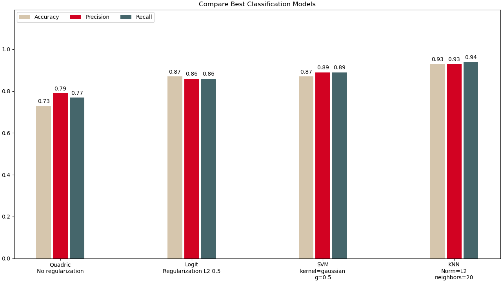
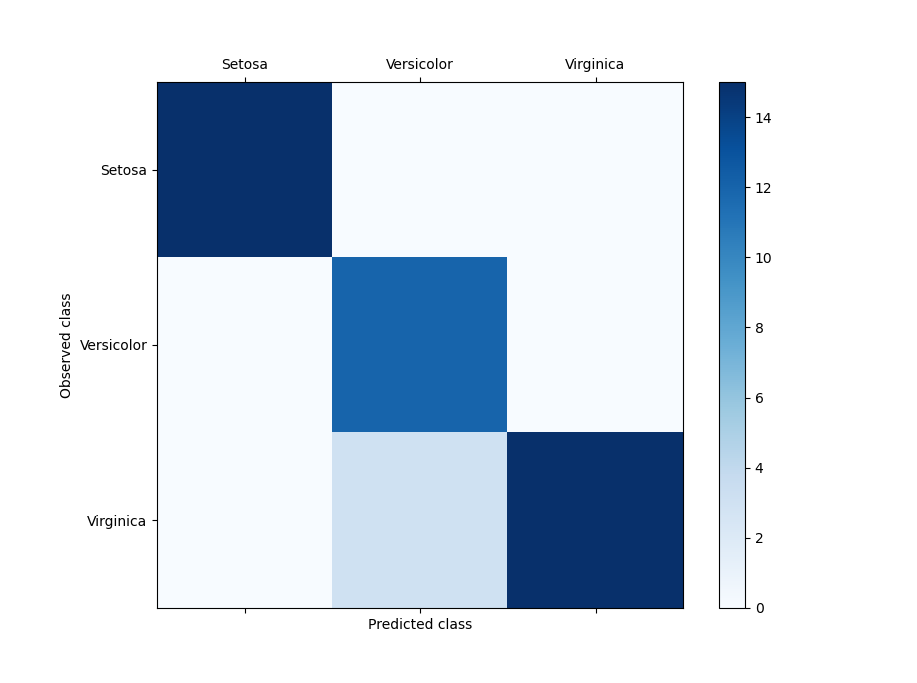

## Description
As part of the course "Machine Learning and Neural Networks", the task of classification on the <a href="https://www.kaggle.com/datasets/uciml/iris">Iris Species</a> dataset was solved.
Implementations of linear and metric models have been written using the quadratic loss function, the logistic loss function, the support vector machine, and the k-nearest neighbors algorithm.The optimization was performed using the 'trust-constr' algorithm from the SciPy library.
# Technologies
* Python 3.13.0+<br>
* SciPy (minimize the loss function)<br>
* Pandas (data loading)<br>
* Numpy (data analysis)<br>
* MatPlotLib (visualization)<br>
## Results
<p align="center">

</p>
The kNN model performed the best, SVM and logistic regression models performed weaker, while the quadratic loss function model performed the worst.<br><br>
<p align="center">
<br><br>
</p>
As can be seen from the confusion matrix for kNN with L2 norm and 20 neighbors, the separation of the Versicolour and Virginica classes did not occur completely, unlike the Setosa class.

## Installation
```bash
#clone repository:
git clone git@github.com:Mayerle/MLClassification.git

#install requirements:
pip install -r requirements.txt
```
## Execution
```python
#import necessary libraries
from instruments.linearmodels import *
from instruments.dftools import *
from instruments.statistic import *
from instruments.view import *
from instruments.datasample import *

#load and split data
x_train, x_test, y_train, y_test = get_data()

#create model instance
logit_model = LogisticCModel(regularization="l2",regularization_factor=0.5)

#fit model
normal = logit_model.fit(x_train,y_train)

#predict
logit_predictions = logit_model.predict(x_test)

#calculate statistics
logit_stats = ClassificationStatistics(y_test,logit_predictions)
matrix = logit_stats.calculate_confusion_matrix()

#plot data
plot_statistic(statistic=logit_stats.calculate_all(),title="Logit Model",digits=2,width=0.4,ylim=[0.8,1])
plt.show()
```
## Examples
To review all the models, run main.py
```bash
python main.py
```
There are also detailed options:<br>
```bash
#for quadric models:
python example_quad.py

#for logistic models:
python example_logit.py

#for svm models:
python example_svm.py

#for kNN models:
python example_knn.py
```
